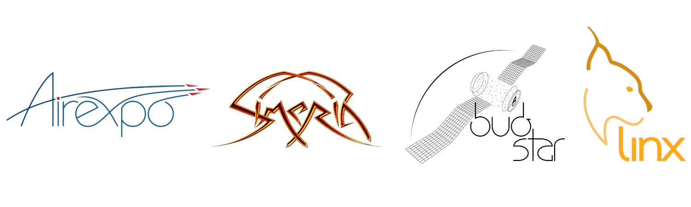

Resume
======

Degrees
-------

.. table::
   :width: 100%
   :widths: 20 80

   ==== ====
   PhD in Signal Processing
   =========
   2015 | Université Rennes I
        | `(Thesis in PDF) <https://ged.univ-rennes1.fr/nuxeo/site/esupversions/cb217ed5-bb4f-4ce9-8cc7-f846b7398e50?inline>`_
   ==== ====

.. table::
   :width: 100%
   :widths: 20 80

   ==== ====
   Aeronautical Engineering Degree
   =========
   2012 `ISAE <https://www.isae-supaero.fr/en/>`_, Toulouse
   ==== ====

.. table::
   :width: 100%
   :widths: 20 80

   ==== ====
   Master 2 Research in Artificial Intelligence
   =========
   2012 Université Toulouse III
   ==== ====

.. table::
   :width: 100%
   :widths: 20 80

   ==== ====
   Awards
   =========
   2024 | Space Foundation's `Space Achievement Award <https://www.esa.int/ESA_Multimedia/Images/2024/04/Euclid_mission_team_honoured_with_Space_Foundation_Award>`_
        | (team prize to the whole Euclid mission team)
   2021 `Euclid Builder <https://www.euclid-ec.org/consortium/builders/>`_
   2021 | Euclid `STAR Prize <https://www.euclid-ec.org/consortium/star-prize/stars2021/>`_
        | (team prize to the French science ground segment core team)
   2012 ISAE Prize
   2011 Winner of the Open CanSat Competition in France
   2010 Winner of the International CanSat Competition in Spain
   2009 Winner of the Open CanSat Competition in France
   ==== ====

Career
------

.. table::
   :width: 100%
   :widths: 20 80

   ============ ====
   Engineer with CNES, Toulouse
   =================
   2022-present Project `Lisa <https://www.esa.int/Science_Exploration/Space_Science/LISA>`_
   \            * System architecture
                * Signal processing
                * Software development (C++, Python, GPU)
                * Profiling, optimization, parallelization
   2015-present Project `Euclid <https://www.esa.int/Science_Exploration/Space_Science/Euclid>`_
   \            * Laureate of the Team Euclid STAR Prize 2021
                * PSF calibration
                * Operations
                * System testing and tools development
                * Science pipelines integration
                * Software development (C++, Python)
                * Profiling, optimization, parallelization
   ============ ====

.. table::
   :width: 100%
   :widths: 20 80

   ========= ====
   PhD student with INRIA, Rennes
   ==============
   2012-2015 Signal processing applied to intracellular microscopy
   \         * Spot detection and tracking
             * Dynamics estimation
             * Model selection
             * Software development (C++)
   ========= ====

.. table::
   :width: 100%
   :widths: 20 80

   ==== ====
   Intern with ENS Ulm, Paris (5 months)
   =========
   2012 Bayesian inference applied to epidemiology
   \    * Software development (C)
        * Benchmarking in the Cloud
   ==== ====
   
.. table::
   :width: 100%
   :widths: 20 80

   ========= ====
   Intern with Thales Avionics, Toulouse (10 months)
   ==============
   2010-2011 Cockpit prototyping framework AirLab
   \         * GUI development (Java)
   ========= ====
   
.. table::
   :width: 100%
   :widths: 20 80

   ==== ====
   Intern with Eurocopter, La Courneuve (2 months)
   =========
   2009 Events
   \    * Graphics
   ==== ====

Teaching
--------

.. table::
   :width: 100%
   :widths: 20 30 50

   ========= ============================ ====
   Space missions: Ground segment
   ===========================================
   2024      CNES-Education summer school | Measuring distances with Euclid
                                          | (1h15)
   2024-2025 ISAE-SUPAERO                 | The mission segment
                                          | (2x 1h30)
   2023-2025 CNES                         | The Euclid science ground segment
                                          | (2x 1h30)
   2022-2023 Hanoi Uni.                   | Ground segment software
                                          | (2x 2h, remotely)
   ========= ============================ ====

.. table::
   :width: 100%
   :widths: 20 30 50

   ==== ============ ====
   CPU architecture
   ======================
   2024 CNES         | Concepts, profiling, optimization
                     | (1h)
   2022 Mêlée Euclid | Concepts, profiling, optimization
                     | (1h)
   ==== ============ ====

.. table::
   :width: 100%
   :widths: 20 30 50

   ==== ===== ====
   Languages
   ===============
   2024 CNES  | Metaprogramming with C++
              | (1h)
   2011 ENSAI | Object oriented programming with C++
              | (6h tutorial)
   2011 ENSAI | Initiation to LaTeX
              | (6h tutorial)
   ==== ===== ====

.. table::
   :width: 100%
   :widths: 20 30 50

   ==== ================== ====
   Microscopy image processing
   ============================
   2013 CNRS, Uni. Paris 7 | Spot tracking
                           | (1h tutorial)
   2013 CNRS, Uni. Paris 7 | Spot detection
                           | (1h tutorial)
   ==== ================== ====

Supervision
-----------

.. table::
   :width: 100%
   :widths: 20 80

   ========= ====
   Postdoc
   ==============
   2015-2017 Tristan Grégoire (3 years, co-supervisor)
   \         * Astronomical catalog IO library
             * Software development (C/C++)
   ========= ====

.. table::
   :width: 100%
   :widths: 20 80

   ============ ====
   PhD student
   =================
   2024-present Tanguy Delmond (co-supervisor)
   \            * Bayesian inference
                * Artificial intelligence
                * Software development (C++/Python, GPU)
   ============ ====

.. table::
   :width: 100%
   :widths: 20 80

   ==== ====
   Master 2 Research internships
   =========
   2024 Tanguy Delmond, ENSEEIHT (6 months)
   \    * Bayesian inference
        * Source detection
        * Software development (Python)
   2017 Peter Kettig, Université Toulouse III (6 months)
   \    * Image processing
        * Library benchmarking (C++, Python)
        * Software development (C++)
   2015 Vincent Briane, INSA Rouen (6 months, co-supervisor)
   \    * Intracellular microscopy
        * Bayesian image processing
   ==== ====

.. table::
   :width: 100%
   :widths: 20 80

   ==== ====
   Engineering internships
   =========
   2023 Edgar Remi, ENSEEIHT (6 months)
   \    * Data compression benchmarking
        * Software development (C++)
   2021 Louis Chauvet-Smart, INSA Toulouse (6 months)
   \    * Telemetry
        * Software development (C/C++)
   2018 Stanislas Bruhière, Centrale-Supélec (6 months)
   \    * GUI generation
        * Software development (Python)
   ==== ====

Outreach
--------

.. table::
   :width: 100%
   :widths: 20 80

   ==== ====
   The Euclid mission, from the ground segment point of view
   =========
   2025 Centrale-Supelec (visiting CNES)
   2023 Paris Air Show, Le Bourget
   2023 ESEO Angers (visiting CNES)
   ==== ====

.. table::
   :width: 100%
   :widths: 20 80

   ==== ====
   `The universe measures 1000 <https://www.youtube.com/watch?v=S_MS6loQQwo>`_
   =========
   2024 TEDx INSA Toulouse
   ==== ====

.. table::
   :width: 100%
   :widths: 20 80

   ==== ====
   Shedding light on our Dark Universe: Euclid, Lisa
   =========
   2024 INSA Toulouse (visiting CNES)
   ==== ====

.. table::
   :width: 100%
   :widths: 20 80

   ==== ====
   From CanSats to CubeSats and satellite constellations
   =========
   2011 Toulouse Science festival
   ==== ====

.. table::
   :width: 100%
   :widths: 20 80

   ==== ====
   The CanSat student project
   =========
   2010 Toulouse Space Show
   ==== ====

Education
---------

.. table::
   :width: 100%
   :widths: 20 80

   ==== ====
   Courses with CNES
   =========
   2025 Environmental impact of the space sector (by AéroDécarbo)
   2024 Astronomy (by IRAP, Pic du Midi Observatory)
   2024 `MaNiTou summer school on gravitational waves <https://indico.in2p3.fr/event/31714/>`_ (by L2IT)
   2024 Image Quality
   2021 `Techniques and Technologies for Space Vehicles <https://advanced.techinspace.fr/en/>`_
   2018 Astronomy (by IRAP, Fleurance)
   2017 Advanced Python (by iForm, Toulouse)
   2016 `Rodolphe Clédassou Euclid summer school <https://ecole-euclid.cnrs.fr/>`_
   ==== ====

.. table::
   :width: 100%
   :widths: 20 80

   ==== ====
   Courses with INRIA
   =========
   2012 Gravity! From Big Bang to Black Holes (by FunMooc, online)
   ==== ====

.. table::
   :width: 100%
   :widths: 20 80

   ========= ====
   Master 2 Research at Université Toulouse III
   ==============
   2024      Astrophysics, Space Sciences and Planetology (as auditor)
   \         * General Relativity (20-hour module)
   2011-2012 Artificial Intelligence
   ========= ====

.. table::
   :width: 100%
   :widths: 20 80

   ========= ====
   Aerospace engineering with ISAE, Toulouse
   ==============
   2011-2012 ISAE-SUPAERO
   2008-2010 ISAE-ENSICA
   ========= ====

Other Projects
--------------

.. table::
   :width: 100%
   :widths: 20 80

   ========= ====
   Graphism
   ==============
   2009-2023 Drawing of various logos
   \         * Various software (see :doc:`software`)
             * `AirExpo <http://airexpo.org/>`_ 2011-2019 (airshow)
             * Simeria (music band)
             * BudStar (CanSat team, see :doc:`interests`)
             * Kastor (association)
   ========= ====

.. table::
   :width: 100%
   :widths: 20 80

   ========= ====
   CanSat (see :doc:`interests`)
   ==============
   2009-2012 Can-sized probe lanched from a balloon or mini-rocket
   \         * Laureate of the ISAE Prize 2012
             * Cooperation with Aerospace Univeristy of Samara, Russia
             * Winner of the France International competitions 2009, 2011,
               Spain International competition 2010
   ========= ====
